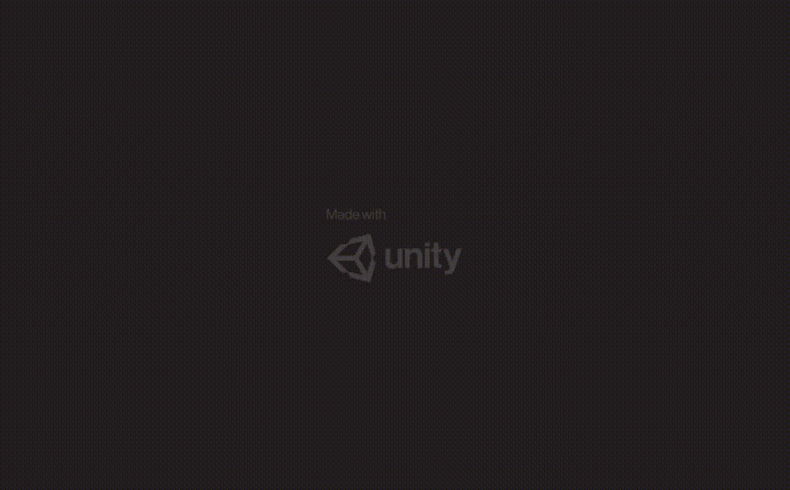

### A collection of popular games, recreated using the Unity Game Engine.

##### Flappy Bird
  

##### Dino Game
  

Most, if not all of the assets in the games are made from scratch.

The purpose of this repo is just to up my Game Dev skills and recreate some awesome game, understanding the game dynamics that drives them.

#### Running the Games

The games are exported in WebGL format so they can be run in the browser, for cross platform support. However, the browser may not allow you to directly run the game from `index.html`. For this, a local server must host the game instead.

Playing the games is straightforward:
``` bash
git clone https://github.com/dkapur17/ReMade.git
cd ReMade/<Game You Want to Play>/WebGL_Export
```
Now you need to run a local server in the folder.
For `Python` users, run:
```bash
python -m http.server 8080
```
`Node.js` users need to install the `http-server` module the first time around, if they haven't already:
```bash
npm install -g http-server
```
Then run:
```bash
http-server -p 8080
```

Then open up you favorite browser that supports WebGL rendering and head to `localhost:8080`. Enjoy the game!

#### Messing Around with the Games

As mentioned above, all the games in this repository are made in Unity, more specifically `2019.4.0f1 LTS` version. So if you want to mess around and modify the games yourself, you'll need Unity set up in your system.
